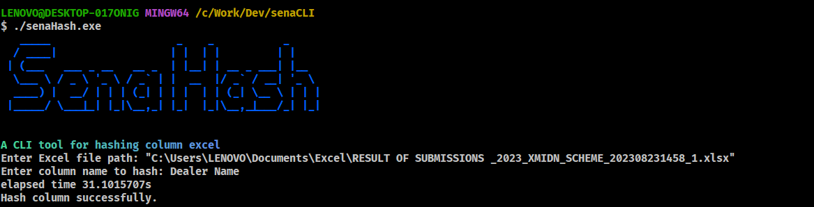

# sena-cli
> A simple CLI app to hashing column excel

## Installation
```
git clone git@github.com:fiuyang/sena-cli.git

cd sena-cli/

./senaHash.exe
```

## Usage
```
sena-cli - A simple hashing column excel

Enter Excel file path:
Enter column name to hash:
```

### Example 
